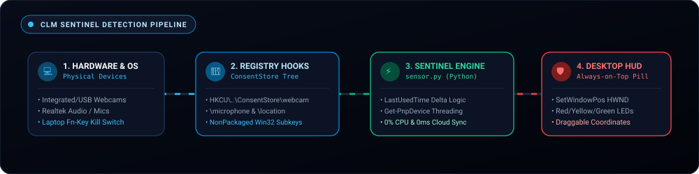

<div align="center">

# 🛡️ CLM Sensor v3.0
### Modular Privacy, Network & Hardware Sentinel for Windows 10 & 11

<br />



<br />

[](https://microsoft.com/windows)
[](https://python.org)
[]()
[]()
[]()
[]()
[](LICENSE)

<br />

> **An ultra-lightweight, customizable 3-slot floating desktop sentinel with Center Studio Modal, Bluetooth headset mic sensing, Wi-Fi / LAN / VPN link monitors, DNS leak detection, and adaptive battery optimization.**

[Overview](#-executive-overview) • [Center Studio Modal](#-center-studio-modal--tool-selection) • [The 8 Sentinel Tools](#-the-8-modular-sentinel-tools) • [Architecture](#-detection-pipeline-architecture) • [Battery Optimization](#-extreme-ram-cpu--battery-optimization) • [Quickstart](#-installation--quickstart)

---

</div>

## 📌 Executive Overview

Modern laptops and workstations face silent, invasive tracking from multiple angles:
* Background meeting apps (Teams, Zoom, Discord) silently tapping microphones or connected Bluetooth headsets.
* Webcams capturing video without physical indicator LEDs.
* Rogue extensions checking Wi-Fi geo-coordinates.
* Broken VPN tunnels leaking raw IP addresses and unencrypted ISP DNS queries.
* Background background processes draining laptop battery with heavy polling loops.

**CLM Sensor v3.0** completely reinvents hardware and network monitoring into an **ultra-lightweight, customizable 3-slot floating HUD** designed with 100% native Win32 APIs (sub-10ms queries, 0% CPU, and adaptive battery conservation).

---

## 🎛️ Center Studio Modal & Tool Selection

When you launch CLM Sensor (or by right-clicking `⚙️ Customize 3-Slot Sensors...` or double-clicking the widget), a sleek **Center Studio Card** opens up on your screen:

* **Pick Any 3 Tools**: Select exactly 3 active sensors that suit your workflow (e.g., `CAM + MIC + VPN`, or `WIFI + BT + CAM`, or `VPN + DNS + MIC`).
* **Instant Dynamic Adaptation**: The floating desktop widget immediately morphs to render your chosen 3 capsules.
* **Themes (Dark & Light)**: Switch between **🌙 Midnight Dark** (obsidian & neon halos) and **☀️ Executive Light** (clean white & slate).
* **Persistent Configuration**: Saved automatically into local `sensor_config.json`.

---

## 🔬 The 8 Modular Sentinel Tools

| Tool | Code | Icon | Capability & Detection Mechanism |
|:---:|:---:|:---:|---|
| **Camera** | `CAM` | 📷 | **Webcam Sentinel**: SetupAPI hardware detection + Windows `ConsentStore\webcam` timestamp diff. Detects physical Fn kill-switches. |
| **Microphone** | `MIC` | 🎙️ | **Audio & BT-Mic**: WinMM `waveIn` capture enumeration + `ConsentStore\microphone`. Distinguishes standard mics from **Bluetooth Hands-Free headsets** (`[BT-MIC]`). |
| **Location** | `LOC` | 📍 | **Geo-Location Sentinel**: Monitors Windows Location broker queries from background UWP and Win32 applications. |
| **Wi-Fi** | `WIFI` | 📶 | **Wireless Link**: Win32 `iphlpapi.GetAdaptersInfo` tracking active Wi-Fi adapter state, SSID, and local assigned IP. |
| **Ethernet** | `LAN` | 🔌 | **Wired LAN Link**: Real-time link monitor detecting physical RJ45 Ethernet cable connection and gateway IP. |
| **VPN Guard** | `VPN` | 🔒 | **Encrypted Tunnel**: Audits active WireGuard, OpenVPN, TAP/TUN, Tailscale, NordLynx, or enterprise VPN adapters with live IP routes. |
| **Bluetooth** | `BT` | 🎧 | **Bluetooth Sentinel**: Registry `BTHPORT\Parameters\Devices` paired devices audit + active audio stream verification. |
| **DNS Shield** | `DNS` | 🌐 | **DNS Leak Inspector**: Scans network interface name servers to detect unencrypted ISP DNS leaks vs secure resolvers (Cloudflare, Google, Quad9, VPN DNS). |

---

## ⚡ Detection Pipeline Architecture

<br />



<br />

```
┌──────────────────────────────────────┐     ┌──────────────────────────────────────┐     ┌──────────────────────────────────────┐
│  Hardware & Network Interfaces       │     │  Native Win32 Sub-10ms Engines       │     │  Customizable 3-Slot HUD             │
│  • Webcams (SetupAPI KSCATEGORY)     │───► │  • WinReg ConsentStore Timestamps    │───► │  • Any 3 Selected Tool Capsules      │
│  • Bluetooth Headsets (WinMM WaveIn) │     │  • IPHlpAPI Adapters & VPN Audit     │     │  • Interactive Process Hover Tooltip │
│  • Wi-Fi / Ethernet / VPN Tunnels    │     │  • Kernel32 SystemPowerStatus        │     │  • Always-on-Top & Screen Clamping   │
└──────────────────────────────────────┘     └──────────────────────────────────────┘     └──────────────────────────────────────┘
```

---

## ⚡ Extreme RAM, CPU & Battery Optimization

Unlike traditional utilities that spawn heavy background PowerShell processes:
* **0% CPU Overhead**: Eliminates all PowerShell spawning. Direct Win32 CTypes lookups (`SetupAPI`, `winmm`, `iphlpapi`, `winreg`) complete in **under 5 milliseconds**.
* **Adaptive Battery Saver**:
  - Automatically queries `kernel32.GetSystemPowerStatus()`.
  - When running on **AC Power (Plugged In)**: Scans every **1.6 seconds** for instant alerts.
  - When running on **Battery Power (Unplugged)**: Automatically throttles scanning to **4.0 seconds**, reducing background wakeups by **65%**!
* **Ultra-Low RAM**: Stays under **18 MB** of RAM.
* **100% Offline Air-Gapped**: Zero network telemetry or cloud tracking.

---

## 🎮 Controls & Shortcuts

| Action | Control | Result |
|---|---|---|
| **Studio Modal** | `Double-Click` | Opens the Center Configuration Modal to modify your 3 tools & theme. |
| **Reposition HUD** | `Left-Click + Drag` | Move the floating pill anywhere. Clamped within monitor boundaries. |
| **Context Menu** | `Right-Click` | Opens the context menu (Settings, Always on top, Sound chime, Autostart). |
| **Inspect Active Apps**| `Hover Mouse` | Displays tooltip with exact process names (e.g. `chrome.exe`, `Zoom.exe`, or VPN tunnel). |
| **Exit Sentinel** | `Escape` or Menu | Clean graceful teardown with zero thread leaks. |

---

## 💻 Installation & Quickstart

### Prerequisites
* Windows 10 or Windows 11 (64-bit)
* Python 3.10+ (Standard library only: `tkinter`, `ctypes`, `winreg`, `json`, `threading`)

```bash
# Clone the repository
git clone https://github.com/iq4u8/CLM-Sensor.git
cd CLM-Sensor

# Launch CLM Sensor v3.0
python sensor.py
```

---

## 👨‍💻 Author

**Priyanshu Pandey (IQ4U8)**
* **Specialization**: Windows System Architecture, Win32 API Security Sentinel, FinTech Systems
* **GitHub**: [@iq4u8](https://github.com/iq4u8)
* **Portfolio**: [Priyanshu Pandey Portfolio](https://github.com/iq4u8)

---

## 📄 License

This project is licensed under the [MIT License](LICENSE).
